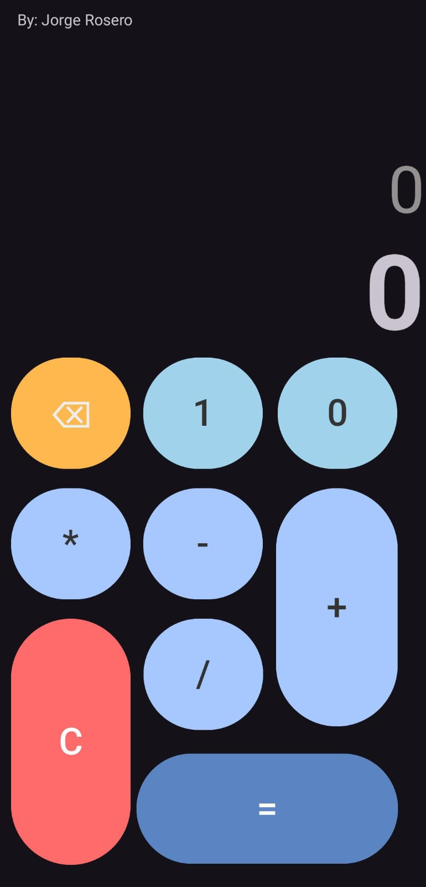
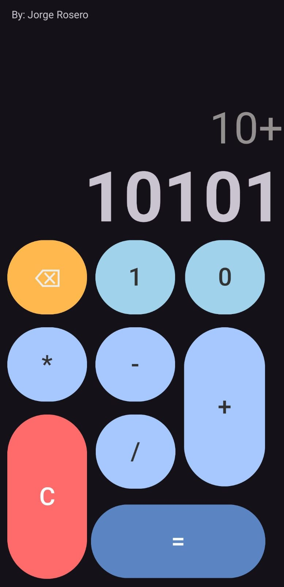
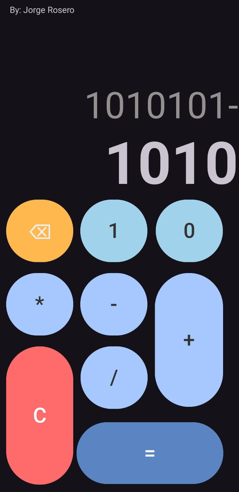
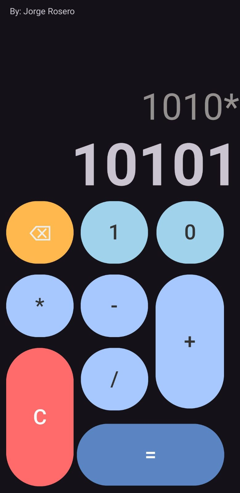
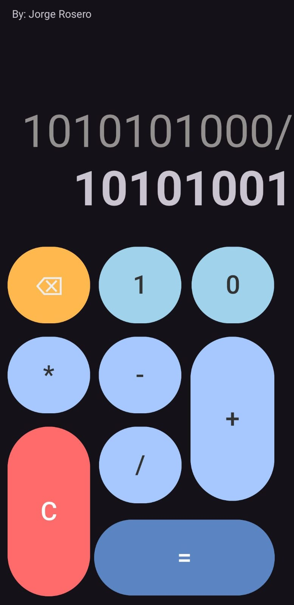
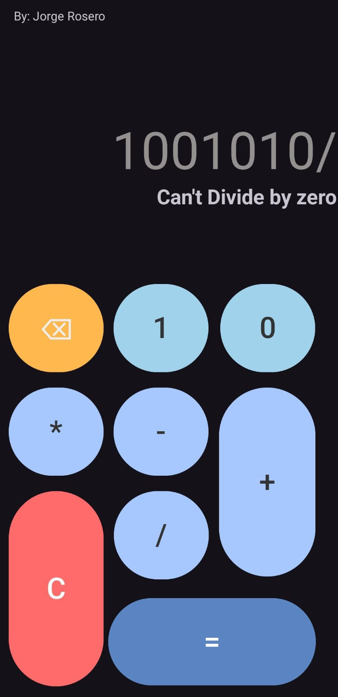

# Calculadora Binaria - Apps Móviles - Jorge Rosero

Este proyecto es una calculadora binaria creada para la asignatura de aplicaciones móviles. La calculadora permite realizar operaciones básicas como suma, resta, multiplicación y división en formato binario.

## Vista previa de la calculadora

A continuación, algunas capturas de pantalla de la calculadora en funcionamiento:

<div style="display: flex; flex-wrap: wrap; gap: 20px;">
  <!-- Fila 1 -->
  <div style="display: flex; flex-direction: column; align-items: center; gap: 10px;">
    <div><strong>Pantalla Principal</strong></div>
    
  </div>
  <div style="display: flex; flex-direction: column; align-items: center; gap: 10px;">
    <div><strong>Operación de Suma</strong></div>
    
  </div>
  <div style="display: flex; flex-direction: column; align-items: center; gap: 10px;">
    <div><strong>Operación de Resta</strong></div>
    
  </div>
</div>

<div style="display: flex; flex-wrap: wrap; gap: 20px; margin-top: 20px;">
  <!-- Fila 2 -->
  <div style="display: flex; flex-direction: column; align-items: center; gap: 10px;">
    <div><strong>Operación de Multiplicación</strong></div>
    
  </div>
  <div style="display: flex; flex-direction: column; align-items: center; gap: 10px;">
    <div><strong>Operación de División</strong></div>
    
  </div>
  <div style="display: flex; flex-direction: column; align-items: center; gap: 10px;">
    <div><strong>Validación al Dividir entre 0</strong></div>
    
  </div>
</div>


## Cómo utilizar

Instrucciones para utilizar la calculadora:
1. Selecciona los números en binario usando los botones disponibles.
2. Elige la operación deseada (+, -, *, /).
3. Presiona el botón de igual (=) para obtener el resultado en binario.
4. Si intentas dividir entre 0, la calculadora mostrará un mensaje de error.

## Tecnologías utilizadas

- **Android Studio**: Entorno de desarrollo utilizado.
- **Java**: Lenguaje de programación utilizado.

## Instalación

Para clonar y ejecutar este proyecto en tu máquina local:

```bash
git clone https://github.com/DevJorgeRafael/calculadora-binaria-apps-moviles.git
